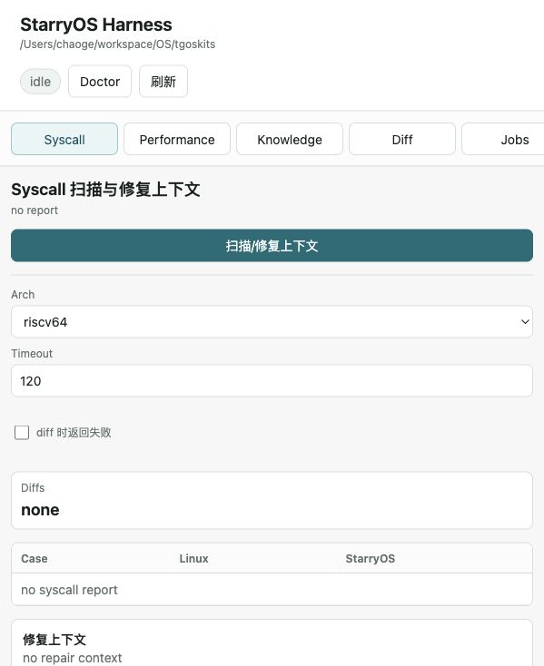
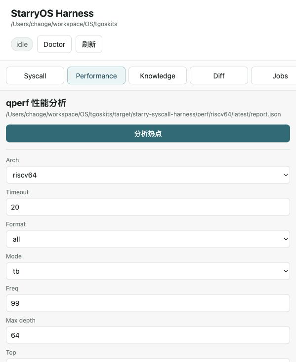
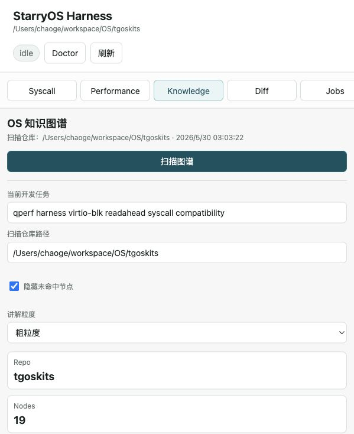
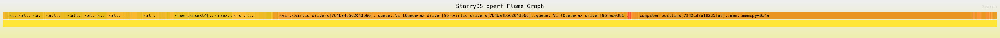
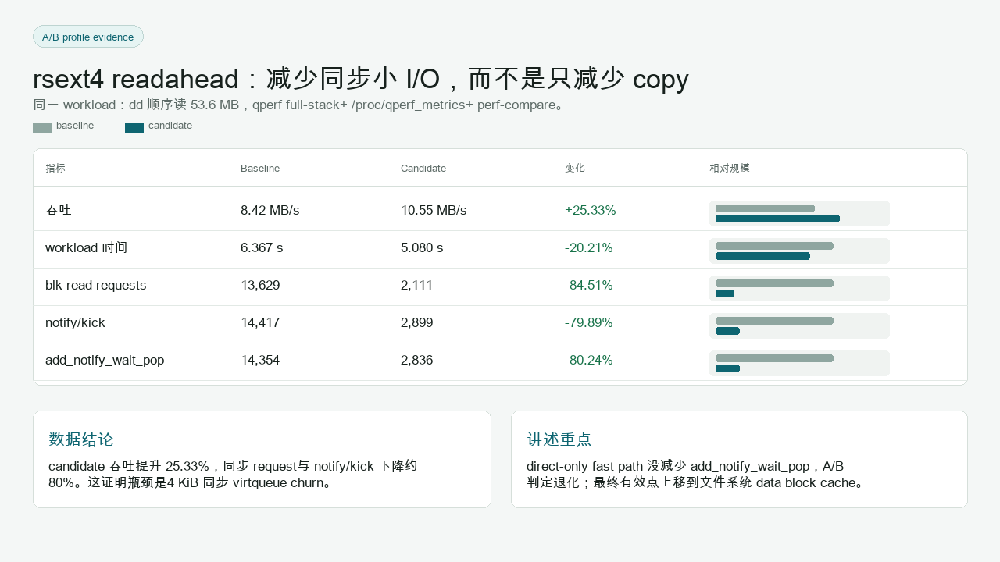

# TGOSKit Harness Kit

Standalone harness tooling for StarryOS/TGOSKits development. The kit packages the syscall differential harness, qperf QEMU plugin tooling, Codex MCP integration, and a local browser UI into one repository that can be pointed at any TGOSKits checkout.

This repository does not vendor StarryOS. Run commands with `--repo-root /path/to/tgoskits`, or register the MCP server with `--repo /path/to/tgoskits`.


## What It Gives You

- A repeatable syscall compatibility loop: compile deterministic probes, run the same cases on Linux and StarryOS, and write machine-readable diffs.
- A qperf performance loop: run StarryOS under QEMU TCG plugin sampling, resolve Rust symbols, generate folded stacks, flamegraphs, reports, and fix candidates.
- A local UI for syscall scans, qperf profiles, perf diffs, and OS knowledge graph navigation.
- Codex integration through a skill plus an MCP server, so the agent can invoke the same workflows instead of hand-building commands.
- Local no-Docker operation by default, with explicit `--repo-root` wiring to the TGOSKits workspace.

## Visual Demo

The browser UI is intentionally thin: it surfaces the same CLI jobs and artifacts so a run can move from reproduction to evidence without changing tools.

| Syscall Scan | qperf Performance | Knowledge Graph |
|---|---|---|
|  |  |  |

qperf output is meant to become reviewable evidence, not just a raw flamegraph. The example below shows a focused block-I/O flamegraph and the A/B metrics table used to justify a readahead change.





<details>
<summary>Full-stack qperf flamegraphs</summary>

Baseline:


Candidate:


</details>

<details>
<summary>Key implementation snippets</summary>


</details>

## Repository Layout

```text
.
├── skills/starry-syscall-harness/        # Codex skill instructions
├── tools/qperf/                          # QEMU TCG plugin and qperf-analyzer
├── tools/starry-syscall-harness/         # CLI, MCP server, UI, probes, reports
├── docs/assets/                          # README/demo images
├── scripts/install-codex-local.sh        # Skill + MCP registration helper
├── Cargo.toml                            # qperf workspace
└── README.md
```

## Local Setup

macOS/Homebrew baseline:

```bash
brew install python@3.13 qemu e2fsprogs u-boot-tools wget coreutils
rustup component add llvm-tools-preview
cargo install cargo-binutils
```

For current qperf plugin compatibility on macOS, QEMU 10.2.1 is preferred. Put the matching QEMU binaries in `PATH`, or set:

```bash
export TGOSKIT_HARNESS_QEMU_BIN=/path/to/qemu-10.2.1/bin
```

Build bundled qperf tools:

```bash
cargo build -p qperf --release
cargo build -p qperf-analyzer --release --features flamegraph
```

Expected outputs:

- `target/release/libqperf.dylib` on macOS, `target/release/libqperf.so` on Linux
- `target/release/qperf-analyzer`

## Run Against TGOSKits

Check local prerequisites:

```bash
python3 tools/starry-syscall-harness/harness.py doctor \
  --no-docker \
  --repo-root /path/to/tgoskits
```

Run a short qperf boot profile:

```bash
python3 tools/starry-syscall-harness/harness.py perf-profile \
  --no-docker \
  --repo-root /path/to/tgoskits \
  --arch riscv64 \
  --timeout 20 \
  --format folded \
  --mode tb
```

Run syscall differential probes:

```bash
python3 tools/starry-syscall-harness/harness.py discover \
  --no-docker \
  --repo-root /path/to/tgoskits \
  --arch riscv64
```

Start the local UI:

```bash
python3 tools/starry-syscall-harness/harness.py ui \
  --no-docker \
  --repo-root /path/to/tgoskits \
  --host 127.0.0.1 \
  --port 8765
```

Reports are written under:

```text
/path/to/tgoskits/target/starry-syscall-harness/
```

Important qperf artifacts:

- `perf/<arch>/latest/report.json`
- `perf/<arch>/latest/report.md`
- `perf/<arch>/latest/hotspots.csv`
- `perf/<arch>/latest/hotspot_categories.csv`
- `perf/<arch>/latest/qperf/stack.folded`
- `perf/<arch>/latest/qperf/flamegraph.svg`
- `perf/<arch>/latest/qperf/qperf.summary.txt`

## Codex Registration

Use the helper:

```bash
scripts/install-codex-local.sh /path/to/tgoskits
```

Manual equivalent:

```bash
mkdir -p "$HOME/.codex/skills"
ln -sfn "$PWD/skills/starry-syscall-harness" "$HOME/.codex/skills/starry-syscall-harness"

codex mcp add starry-syscall-harness -- \
  python3 "$PWD/tools/starry-syscall-harness/mcp_server.py" \
  --repo /path/to/tgoskits
```

MCP tools exposed:

- `starry_syscall_doctor`
- `starry_syscall_discover`
- `starry_perf_profile`
- `starry_perf_diff`
- `starry_harness_ui_command`

## qperf Model

qperf is a QEMU TCG plugin, not host `perf`. It samples guest PCs and optional guest stack context through QEMU callbacks, writes raw records to `qperf.bin`, and resolves them against the StarryOS kernel ELF.

The plugin summary includes:

- `samples`, `dropped_samples`, `sample_failures`
- `translated_blocks`, `translated_instructions`
- `executed_blocks`, `executed_instructions`, `execute_callbacks`

Host `perf stat`, when enabled, measures the host QEMU process and plugin overhead. Treat host counters as context, not guest PMU counters.

## Notes

- `perf-profile` delegates StarryOS build/run work to the target TGOSKits checkout through `cargo xtask starry perf`.
- `discover` needs Linux-musl cross compilers such as `riscv64-linux-musl-gcc` for Linux reference probes.
- The UI reads and writes only local files under the configured TGOSKits checkout.
- Keep generated profile outputs out of this repository; commit reproducible harness code and compact visual assets instead.
